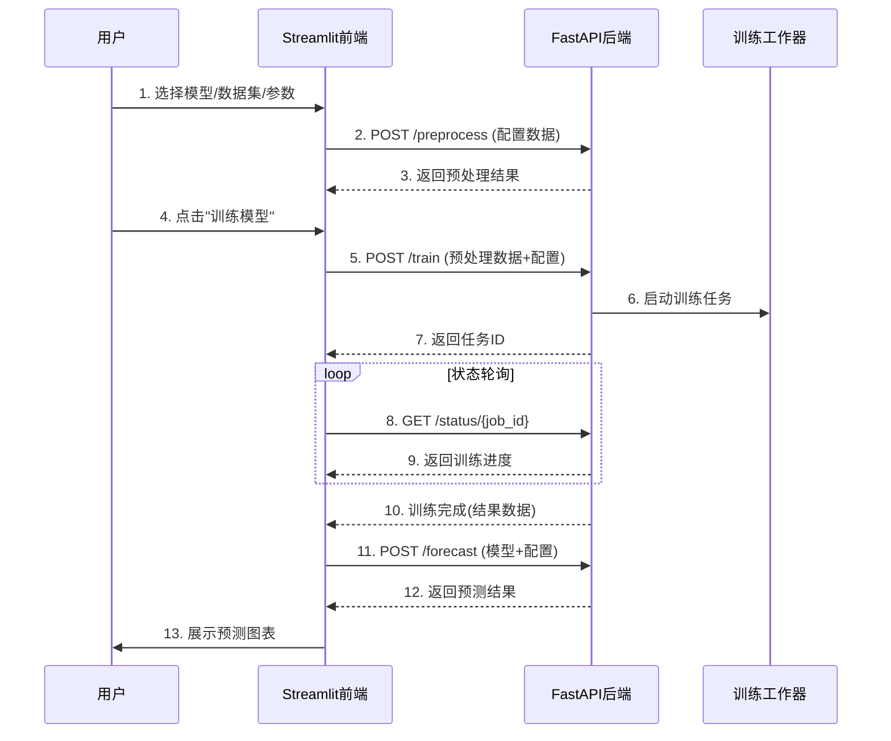

# Time Series Forecasting Lab


**Time Series Forecasting Lab** 是一个先进的时序预测平台，支持多种神经网络架构与传统模型对比，提供直观的数据分析、模型训练和预测结果可视化功能。

## ✨ 项目亮点

- **多模型支持**：包括 Neural ARIMA、TCN、GRU 等多种先进模型
- **交互式探索**：实时数据可视化和模型配置
- **端到端工作流**：从数据预处理到预测结果展示完整流程
- **专业分析工具**：包含差分数据分析和平稳性检验
- **模块化设计**：清晰的前后端分离架构

## 🚀 快速开始

### 系统要求
- Python 3.8+
- pip 包管理器

### 安装步骤

1. **克隆仓库**：
   ```bash
   git clone https://github.com/Itsumokw/mlpj.git
   cd mlpj
   ```

2. **安装依赖**：
   ```bash
   pip install -r requirements.txt
   ```

### 启动应用

1. **启动后端服务**：
   ```bash
   cd backend
   uvicorn main:app --reload --port 8080
   
   ```

2. **启动前端应用**：
   ```bash
   streamlit run frontend/app.py
   ```
   或者
   ```bash
   python -m streamlit run frontend/app.py
   ``` 
   

3. **访问应用**：
   在浏览器中打开：`http://localhost:8501`

## 🧩 项目结构

```bash
time-series-forecast-lab/
├── frontend/                  # 前端代码
│   ├── app.py                 # 主应用入口
│   ├── api_client.py          # API客户端
│   ├── components/            # UI组件
│   │   ├── sidebar.py         # 侧边栏配置
│   │   ├── data_view.py       # 数据展示
│   │   ├── training_view.py   # 训练结果展示
│   │   └── forecast_view.py   # 预测结果展示
│   └── utils.py               # 前端工具函数
├── backend/                   # 后端代码
│   ├── main.py                # FastAPI入口
│   ├── data_processor.py      # 数据预处理
│   ├── models/                # 模型实现
│   │   ├── arima.py           # Neural ARIMA
│   │   ├── tcn.py             # TCN模型
│   │   ├── gru.py             # GRU模型
│   │   └── linear.py          # 线性模型
│   ├── trainer.py             # 训练任务管理
│   ├── utils.py               # 后端工具函数
│   ├── predictor.py           # 预测服务
│   └── schemas.py             # Pydantic模型
├── tests/                     # 测试代码
├── requirements.txt           # Python依赖
└── README.md                  # 项目文档
```

## 📊 使用指南

### 1. 配置模型参数

在左侧边栏中：
- 选择预测模型（Neural ARIMA、TCN、GRU等）
- 配置模型超参数（隐藏层大小、层数、dropout率等）
- 设置训练参数（学习率、训练轮数）

### 2. 加载数据集

支持两种数据源：
1. **内置数据集**：Air Passengers (1949-1960)
2. **自定义数据集**：上传CSV文件并指定时间列和数值列(可使用datasets里已有的jena_climate_cut和AirPassenger数据集测试)

### 3. 数据探索

- **原始数据预览**：查看数据集前几行
- **数据可视化**：交互式时间序列图表
- **差分数据分析**：一阶/二阶差分及平稳性检验

### 4. 训练模型

1. 点击"🚀 Train Model"按钮开始训练
2. 实时查看训练进度
3. 分析训练结果（损失曲线、测试误差）

### 5. 生成预测

1. 设置预测步长（1-36个月）
2. 查看预测结果图表
3. 对比历史数据和预测结果

## 🔧 开发指南

### 前后端交互流程



### API规范

#### 数据预处理 (`/preprocess`)
**请求**：
```json
{
  "dataset_name": "Air Passengers (Default)",
  "time_col": "Month",
  "value_col": "#Passengers",
  "p": 12,
  "q": 1
}
```

**响应**：
```json
{
  "X_train": [[0.1, 0.2, ...], ...],
  "y_train": [0.3, 0.4, ...],
  "X_test": [[0.5, 0.6, ...], ...],
  "y_test": [0.7, 0.8, ...],
  "scaler": {
    "type": "MinMaxScaler",
    "params": {"feature_range": [-1, 1]}
  }
}
```

#### 启动训练 (`/train`)
**请求**：
```json
{
  "config": {
    "model_type": "Neural ARIMA",
    "hidden_size": 64,
    "num_layers": 3
  },
  "train_data": { ... }
}
```

**响应**：
```json
{
  "job_id": "training_123456",
  "status": "queued"
}
```

#### 预测 (`/forecast`)
**请求**：
```json
{
  "model_state": { ... },
  "forecast_months": 12,
  "last_values": [112, 118, ...]
}
```

**响应**：
```json
{
  "forecast_values": [125.3, 128.7, ...],
  "forecast_dates": ["2025-01", "2025-02", ...],
  "history_values": [112, 118, ...],
  "history_dates": ["1949-01", "1949-02", ...]
}
```
---
