## 预期的整体项目结构

### 项目目录结构
```bash
time-series-forecast-lab/
├── frontend/                  # 前端代码（已完成）
│   ├── app.py                 # 主应用入口
│   ├── api_client.py          # API客户端
│   ├── components/            # UI组件
│   │   ├── sidebar.py         # 侧边栏配置
│   │   ├── data_view.py       # 数据展示
│   │   ├── training_view.py   # 训练结果展示
│   │   └── forecast_view.py   # 预测结果展示
│   └── utils.py               # 工具函数
├── backend/                   # 后端代码（待实现）
│   ├── main.py                # FastAPI入口
│   ├── data_processor.py      # 数据预处理
│   ├── models/                # 模型实现
│   │   ├── arima.py           # Neural ARIMA
│   │   ├── tcn.py             # TCN模型
│   │   ├── gru.py             # GRU模型
│   │   └── linear.py          # 线性模型
│   ├── trainer.py             # 训练任务管理
│   ├── predictor.py           # 预测服务
│   └── schemas.py             # Pydantic模型
├── config/                    # 配置文件
│   └── settings.py            # 应用设置
├── tests/                     # 测试代码
│   ├── test_frontend.py       # 前端测试
│   └── test_backend.py        # 后端测试
├── requirements.txt           # Python依赖
└── README.md                  # 项目文档
```

### 前后端交互流程

```mermaid
sequenceDiagram
    participant User as 用户
    participant Frontend as Streamlit前端
    participant Backend as FastAPI后端
    participant Worker as 训练工作器
    
    User->>Frontend: 1. 选择模型/数据集/参数
    Frontend->>Backend: 2. POST /preprocess (配置数据)
    Backend-->>Frontend: 3. 返回预处理结果
    
    User->>Frontend: 4. 点击"训练模型"
    Frontend->>Backend: 5. POST /train (预处理数据+配置)
    Backend->>Worker: 6. 启动训练任务
    Backend-->>Frontend: 7. 返回任务ID
    
    loop 状态轮询
        Frontend->>Backend: 8. GET /status/{job_id}
        Backend-->>Frontend: 9. 返回训练进度
    end
    
    Backend-->>Frontend: 10. 训练完成(结果数据)
    Frontend->>Backend: 11. POST /forecast (模型+配置)
    Backend-->>Frontend: 12. 返回预测结果
    Frontend->>User: 13. 展示预测图表
```


## 后端同学如何接手前端代码

### 1. 前端代码结构说明
**核心文件**：
- `app.py`：主应用入口，协调整个工作流
- `api_client.py`：定义所有API请求方法（需要后端实现对应接口）
- `components/`：UI组件模块化实现

**关键session_state变量**：
```python
# 前端维护的状态变量
st.session_state = {
    "model_config": {       # 用户配置
        "selected_model": "Neural ARIMA",
        "dataset": "Air Passengers (Default)",
        "custom_data": None,  # 自定义数据集
        "time_col": "Month",
        "value_col": "#Passengers",
        # ...其他参数
    },
    "preprocessed_data": None,  # 后端返回的预处理数据
    "training_job_id": None,    # 训练任务ID
    "training_results": None,   # 训练完成后的结果
    "forecast_results": None    # 预测结果
}
```

### 2. API接口规范
前端已实现以下API调用方法，后端需实现对应接口：

#### 数据预处理 (`api_client.preprocess_data`)
**请求示例**：
```python
payload = {
    "dataset_name": config["dataset"],
    "time_col": config["time_col"],
    "value_col": config["value_col"],
    "custom_data": config.get("custom_data", None),
    "p": config.get("p", 12),  # ARIMA参数
    "q": config.get("q", 1)    # ARIMA参数
}
```

**期望响应**：
```json
{
  "X_train": [[0.1, 0.2, ...], ...],
  "y_train": [0.3, 0.4, ...],
  "X_test": [[0.5, 0.6, ...], ...],
  "y_test": [0.7, 0.8, ...],
  "scaler": {  # 序列化的归一化器
    "type": "MinMaxScaler",
    "params": {"feature_range": [-1, 1]}
  }
}
```

#### 启动训练 (`api_client.train_model`)
**请求示例**：
```python
payload = {
    "config": {
        "model_type": config["selected_model"],
        "hidden_size": config.get("hidden_size", 64),
        # ...其他模型参数
    },
    "train_data": preprocessed_data  # 预处理结果
}
```

**期望响应**：
```json
{
  "job_id": "training_123456",
  "status": "queued"
}
```

#### 训练状态查询 (`api_client.get_training_status`)
**请求**：`GET /status/{job_id}`

**期望响应**：
```json
{
  "job_id": "training_123456",
  "status": "training" | "completed" | "failed",
  "progress": 65,  # 百分比
  "results": {      # 仅当status=completed时存在
    "model_state": { ... },  # 可序列化的模型状态
    "loss_history": [0.5, 0.4, ...],
    "test_rmse": 12.34,
    "training_time": 120.5
  }
}
```

#### 预测 (`api_client.forecast`)
**请求示例**：
```python
payload = {
    "model_state": training_results['model_state'],
    "forecast_months": config["forecast_months"],
    "output_steps": config.get("output_steps", 12),
    "last_values": [...]  # 最后N个数据点
}
```

**期望响应**：
```json
{
  "forecast_values": [125.3, 128.7, ...],
  "forecast_dates": ["2025-01", "2025-02", ...],
  "history_values": [112, 118, ...],
  "history_dates": ["1949-01", "1949-02", ...]
}
```

### 3. 如何运行前端代码
1. **安装依赖**：
   ```bash
   pip install -r requirements.txt
   # 主要依赖：streamlit, pandas, matplotlib, requests
   ```

2. **启动前端**：
   ```bash
   cd frontend
   streamlit run app.py
   ```

   或者直接在项目目录下运行

    ```bash
    python -m streamlit run ./frontend/app.py
    ```
3. **配置后端地址**（修改`api_client.py`）：
   ```python
   # 开发环境
   BACKEND_URL = "http://localhost:8000"
   
   # 生产环境
   # BACKEND_URL = "https://your-api-domain.com"
   ```

### 4. 前后端联调指南
1. **启动后端服务**：
   ```bash
   cd backend
   uvicorn main:app --reload --port 8000
   ```

2. **前端操作流程**：
   1. 访问 `http://localhost:8501`
   2. 在侧边栏选择模型和参数
   3. 上传数据集（或使用默认数据）
   4. 点击"🚀 Train Model"按钮
   5. 观察训练进度和结果

3. **调试建议**：
   - 使用Postman测试API接口
   - 在前端添加调试输出：
     ```python
     st.write("Request payload:", payload)
     st.write("API response:", response.json())
     ```
   - 后端添加详细日志：
     ```python
     import logging
     logging.basicConfig(level=logging.DEBUG)
     ```

### 5. 后端开发重点
1. **数据预处理**：
   - 实现不同模型的数据转换逻辑
   - 确保序列化/反序列化兼容性

2. **模型训练**：
   - 使用Celery或BackgroundTasks管理异步任务
   - 实现训练状态持久化（Redis或数据库）

3. **预测服务**：
   - 模型加载和缓存优化
   - 处理多种预测场景（单步/多步预测）

4. **错误处理**：
   ```python
   try:
       # 处理逻辑
   except Exception as e:
       logger.error(f"Error processing request: {str(e)}")
       return JSONResponse(
           status_code=500,
           content={"detail": "Internal server error", "error": str(e)}
       )
   ```

### 6. 交接清单
1. 前端完整代码（`frontend/`目录）
2. API接口规范文档（本文档）
3. 测试数据集：
   - `air_passengers.csv`（内置默认数据）
   - `sample_sales_data.csv`（测试用自定义数据）
4. 前端依赖列表（`requirements.txt`）
5. 联系人信息（您的联系方式）

## 总结说明
您的后端同学需要：
1. 实现FastAPI服务，包含指定的API端点
2. 根据模型类型实现数据处理和训练逻辑
3. 确保API响应格式与前端期望一致
4. 处理异步训练任务和状态跟踪
5. 实现预测服务并优化性能

您已完成的前端代码：
- 提供完整的用户界面和工作流
- 包含所有API调用方法的实现
- 处理了用户配置和状态管理
- 实现了数据可视化和结果展示

后端同学可以：
1. 直接使用您的前端代码进行开发和测试
2. 根据`api_client.py`中的方法实现后端接口
3. 参考本文档中的请求/响应格式规范
4. 使用提供的测试数据集进行验证

建议后端开发顺序：
```mermaid
gantt
    title 后端开发计划
    dateFormat  YYYY-MM-DD
    section 核心模块
    数据预处理      ：done,  des1, 2024-06-15, 3d
    API框架搭建    ：active, des2, 2024-06-18, 2d
    ARIMA模型实现   ： des3, after des2, 4d
    TCN模型实现     ： des4, after des3, 4d
    
    section 进阶功能
    训练任务队列    ： des5, after des2, 3d
    预测服务优化    ： des6, after des4, 3d
    性能监控        ： des7, after des5, 2d
```

通过清晰的接口定义和模块化设计，前后端可以并行开发。前端代码已处于可运行状态，后端同学可以基于现有API规范直接实现服务端逻辑。